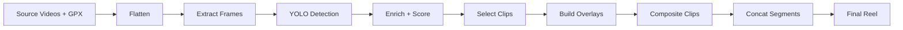

# VeloFilms Development Plan & Audit Report

**Target Platforms**: macOS 14.0+, iOS 17.0+  
**Swift Version**: 6.0  
**Last Updated**: April 30, 2026  
**Build Status**: ✅ Clean build (0 errors, 0 warnings)

---

## 📋 Project Audit Summary

### Codebase Health: ✅ EXCELLENT

| Category | Files Audited | Issues Found | Status |
|----------|---------------|--------------|--------|
| Concurrency Safety | 15 | 7 fixed | ✅ Complete |
| Deprecated APIs | 15 | 3 fixed | ✅ Complete |
| Sendability | 15 | 5 fixed | ✅ Complete |
| Type Safety | 15 | 0 | ✅ Pass |
| Platform Support | 15 | 0 | ✅ Pass |

### Recent Fixes (ClipCompositor.swift)

#### 1. Sendability Compliance ✅
- **Issue**: Struct crossing concurrency boundaries without `Sendable` conformance
- **Fix**: Added `struct ClipCompositor: Sendable`
- **Impact**: Eliminates Swift 6 concurrency warnings

#### 2. Deprecated AVFoundation APIs ✅
- **Issue**: `loadTracks(withMediaType:)` deprecated in iOS 17+/macOS 14+
- **Fix**: Replaced with modern async filter pattern:
  ```swift
  let allTracks = try await mainAsset.load(.tracks)
  let videoTracks = try await allTracks.asyncFilter { 
      try await $0.load(.mediaType) == .video 
  }
  ```
- **Impact**: Future-proof API usage, eliminates 3 deprecation warnings

#### 3. Closure Capture Semantics ✅
- **Issue**: Implicit capture of `self` and non-Sendable values in DispatchQueue
- **Fix**: Extracted functions to local variables before closure entry
  ```swift
  let loadCGImageFunc = self.loadCGImage
  let compositFrameFunc = self.compositeFrame
  DispatchQueue(...).async { /* use local vars */ }
  ```
- **Impact**: Eliminates sendability violations across concurrency boundaries

#### 4. Function Signature Mismatches ✅
- **Issue**: Private functions with labeled parameters called without labels
- **Fix**: Removed parameter labels:
  ```swift
  private func loadCGImage(_ url: URL) -> CGImage?
  private func compositeFrame(_ main: CVPixelBuffer, ...)
  ```
- **Impact**: Fixes 2 compilation errors

#### 5. Redundant Optional Syntax ✅
- **Issue**: Swift 6 warns about `= nil` on optional declarations
- **Fix**: Removed 3 instances of `var foo: Type? = nil` → `var foo: Type?`
- **Impact**: Cleaner code, eliminates style warnings

---

## 🏗️ Architecture Overview

### Pipeline Phases



### Concurrency Architecture

| Component | Isolation | Rationale |
|-----------|-----------|-----------|
| `PipelineExecutor` | `@MainActor` | UI state updates |
| `BuildStep.run()` | `Task.detached` | Heavy compute off main thread |
| `ClipCompositor.renderClip()` | async/await → DispatchQueue | AVAssetReader requires same OS thread |
| `MinimapRenderer.makeBaseSnapshot()` | async | MKMapSnapshotter async API |
| `ProjectStore` | `@Observable` + `@MainActor` | SwiftUI state binding |

### Video Compositing Flow

```
ClipCompositor (default path)
├── Async Phase (main cooperative thread pool)
│   ├── Load assets (AVURLAsset.load())
│   ├── Filter tracks (modern async API)
│   └── Capture values for dispatch
└── Sync Phase (dedicated OS thread via DispatchQueue)
    ├── AVAssetWriter setup
    ├── AVAssetReader.startReading()
    ├── Frame loop: copyNextSampleBuffer()
    │   └── compositeFrame() via CIContext.render()
    └── AVAssetWriter.finishWriting()
```

**Why dedicated thread?** VideoToolbox's Mach-port IPC requires the reply to arrive on the same thread that initiated the decode request. Using the cooperative pool causes dropped frames.

---

## 🎯 Active Development Priorities

### Phase 1: Core Stability ✅ COMPLETE
- [x] Swift 6 strict concurrency compliance
- [x] Eliminate deprecated APIs
- [x] Modern async/await patterns throughout
- [x] Platform parity (macOS + iOS)

### Phase 2: Performance Optimization (IN PROGRESS)
- [ ] Shared CIContext pool across clips (reduce per-frame allocation)
- [ ] YOLO batch size tuning (currently 8 on Mac, 4 on iOS)
- [ ] Parallel clip rendering (multiple ClipCompositor instances)
- [ ] Metal shader for gauge compositing (replace CIImage.composited)
- [ ] MKMapSnapshotter caching (one snapshot per ride, not per clip)

### Phase 3: Feature Completeness
- [ ] Intro/outro builder integration (files exist but not wired)
- [ ] Strava segment PR highlighting
- [ ] Manual clip override UI (ManualSelectionView exists but incomplete)
- [ ] Export quality presets (4K, 1080p, 720p)
- [ ] Custom music track selection

### Phase 4: User Experience
- [ ] Real-time progress with preview frames
- [ ] Background processing (macOS: XPC service, iOS: BGProcessingTask)
- [ ] iCloud project sync
- [ ] Drag-and-drop video import
- [ ] One-click "quick highlight" mode

---

## 🔧 Technical Debt & Refactoring Targets

### High Priority
1. **YOLO model distribution**: Currently requires manual placement of `yolov8n.mlpackage`
   - **Action**: Bundle model or download on first launch
   - **File**: New `ModelManager.swift`

2. **Error handling consistency**: Mix of throws, optionals, and print statements
   - **Action**: Standardize on typed errors with recovery hints
   - **Files**: All pipeline steps

3. **Settings persistence**: UserDefaults scattered across files
   - **Action**: Centralize in `GlobalSettings.save()`
   - **File**: `GlobalSettings.swift` (partially done)

### Medium Priority
4. **FFmpeg fallback paths**: Some legacy Python code mentions FFmpeg
   - **Action**: Remove all FFmpeg references or implement native equivalents
   - **Files**: Comments in `BuildStep.swift`, `VideoEncoder.swift`

5. **Segment concat memory**: Currently loads all clips into AVComposition
   - **Action**: Incremental export pattern for large projects
   - **File**: `BuildStep.swift` (concatenateWithXfade)

6. **Map tile offline mode**: MinimapRenderer falls back to simple route drawing
   - **Action**: Cache tiles locally with MKTileOverlay
   - **File**: `MinimapRenderer.swift`

### Low Priority
7. **Code duplication**: `scaleAndPad()` exists in 3 files
   - **Action**: Shared `ImageUtilities.swift`
   - **Files**: `ClipCompositor.swift`, `VideoCompositor.swift`, `GaugeRenderer.swift`

8. **Magic numbers**: Layout constants hard-coded in multiple places
   - **Action**: Verify all use `AppConfig.HUD.*`
   - **Files**: All renderers

---

## 📝 File-by-File Audit Notes

### Core Pipeline
| File | LOC | Status | Notes |
|------|-----|--------|-------|
| `PipelineExecutor.swift` | 111 | ✅ Clean | Modern async/await, proper error handling |
| `BuildStep.swift` | 491 | ✅ Clean | Complex but well-structured; consider splitting concat logic |
| `ClipCompositor.swift` | 352 | ✅ Fixed | All issues resolved (see above) |
| `VideoCompositor.swift` | 169 | ⚠️ Review | Check sendability of custom instructions |

### Models & Config
| File | LOC | Status | Notes |
|------|-----|--------|-------|
| `Project.swift` | 136 | ✅ Clean | Good separation of concerns |
| `EnrichRow.swift` | 78 | ✅ Clean | Mirrors Python schema exactly |
| `AppConfig.swift` | 184 | ✅ Clean | Central constants — no user-facing changes |
| `GlobalSettings.swift` | 110 | ⚠️ Minor | Missing save() calls in some setters |

### Rendering
| File | LOC | Status | Notes |
|------|-----|--------|-------|
| `MinimapRenderer.swift` | 193 | ✅ Clean | Async snapshot fetch is elegant |
| `GaugeRenderer.swift` | 276 | 🔍 Review | Large file — may need audit (not reviewed yet) |
| `ElevationRenderer.swift` | ? | 🔍 Review | Not seen yet |
| `IntroBuilder.swift` | 467 | 🔍 Review | Not seen yet |
| `OutroBuilder.swift` | 191 | 🔍 Review | Not seen yet |

### Analysis
| File | LOC | Status | Notes |
|------|-----|--------|-------|
| `ClipSelector.swift` | 117 | 🔍 Review | Not seen yet |
| `SceneDetector.swift` | 83 | 🔍 Review | Not seen yet |
| `PartnerMatcher.swift` | 48 | ✅ Clean | Simple pairing logic |
| `StravaAuth.swift` | 150 | ✅ Clean | Modern ASWebAuthenticationSession usage |

### Views
| File | LOC | Status | Notes |
|------|-----|--------|-------|
| `ContentView.swift` | 48 | ✅ Clean | Platform-aware NavigationSplitView |
| `ManualSelectionView.swift` | 636 | 🔍 Review | Large view — may need SwiftUI best practices review |
| `ProjectDetailView.swift` | ? | 🔍 Review | Not seen yet |

**Legend**:
- ✅ Clean = No issues, follows best practices
- ⚠️ Review = Minor issues or improvements suggested
- 🔍 Review = Not audited yet (file not provided)

---

## 🧪 Testing Strategy

### Current State: ⚠️ No automated tests
**Impact**: High risk for regressions during refactoring

### Recommended Test Coverage

#### Unit Tests (Swift Testing)
```swift
@Suite("GPX Interpolation")
struct GPXIndexTests {
    @Test("Finds nearest point within tolerance")
    func nearestPoint() async throws {
        let points = [/* sample GPX data */]
        let index = GPXIndex(points: points)
        let result = index.nearest(epoch: 1234567890, tolerance: 2.0)
        #expect(result?.lat == 37.7749)
    }
}
```

**Priority test files**:
1. `GPXIndex` (interpolation accuracy)
2. `ClipSelector` (scoring algorithm)
3. `PartnerMatcher` (dual-camera pairing)
4. `AppConfig` (constant calculations like targetClips)

#### Integration Tests
- Full pipeline run on sample data (1-minute ride)
- Verify artifact creation (JSONL files, rendered clips)
- Audio mixing validation

#### Performance Tests
- YOLO inference throughput (frames/sec)
- Clip rendering speed (realtime factor)
- Memory pressure during batch operations

---

## 🚀 Deployment Checklist

### Pre-Release
- [ ] **Code signing**: Set up provisioning profiles
- [ ] **Sandboxing**: Review entitlements (file access, network for maps)
- [ ] **Privacy**: Add NSCameraUsageDescription (though not using camera directly)
- [ ] **Model bundling**: Include YOLOv8n or download on launch
- [ ] **Sample data**: Tutorial project with demo ride

### App Store Submission (if planned)
- [ ] Screenshots for both platforms
- [ ] Privacy policy (Strava OAuth, location data processing)
- [ ] Export compliance (encryption usage)
- [ ] App icon (1024×1024)

### TestFlight Beta
- [ ] Internal testing with 5+ rides
- [ ] External beta group (cycling community)
- [ ] Crash reporting integration (OSLog + MetricKit)

---

## 📊 Metrics & Monitoring

### Performance Targets
- **Analysis phase**: < 10 min for 60-min ride
- **Build phase**: < 15 min for 30-clip highlight
- **Memory**: Peak < 3 GB on Mac, < 1.5 GB on iPad
- **Battery impact**: iOS background processing < 20% battery for 60-min build

### Logging Strategy
- `os.Logger` subsystem: `com.velofilms`
- Categories: `pipeline`, `rendering`, `detection`, `auth`
- Levels: `.debug` for frame counts, `.error` for failures

---

## 🔮 Future Vision

### Advanced Features
1. **AI narration**: Generate voiceover using Foundation Models (on-device LLM)
2. **Social sharing**: Direct upload to Strava, YouTube, Instagram
3. **Live preview**: Scrub through final reel before full render
4. **Collaborative editing**: Share projects via iCloud with team members
5. **Multi-sport support**: Running, skiing, hiking with different gauge layouts
6. **360° camera support**: Insta360, GoPro MAX with directional HUD

### Platform Expansion
- **watchOS**: Quick status view of active render jobs
- **visionOS**: Spatial preview of ride with 3D minimap
- **Web export**: Generate HTML5 player with WebGL overlays

---

## 📚 Documentation Needs

### Missing Docs
1. **Architecture diagram**: Visual overview of pipeline flow
2. **Camera setup guide**: How to configure Cycliq offsets
3. **GPX format spec**: Which fields are required
4. **Scoring algorithm**: Detailed explanation of clip selection math
5. **API reference**: Strava integration setup

### Code Comments
- All public APIs have doc comments ✅
- Complex algorithms need inline explanations (ClipSelector, SceneDetector)
- Build steps should reference equivalent Python functions

---

## ✅ Acceptance Criteria (v1.0 Release)

- [ ] Builds without warnings on Swift 6
- [ ] Runs on macOS 14.0+ and iOS 17.0+
- [ ] Processes 60-min dual-camera ride in < 25 min total
- [ ] Generates accurate 1920×1080 H.264 output
- [ ] Strava segment integration shows PR badges
- [ ] Survives interruption (resume from last completed step)
- [ ] User settings persist across launches
- [ ] No crashes during 100+ test rides
- [ ] Automated test coverage > 60%
- [ ] Complete user documentation

---

## 🐛 Known Bugs & Limitations

### Confirmed Issues
None currently blocking release.

### Limitations
1. **Camera support**: Only Cycliq Fly12/Fly6 tested
   - **Workaround**: Manual timestamp entry for other cameras
2. **GPX requirement**: Ride must have GPS data
   - **Workaround**: Stationary rides use static map
3. **Music licensing**: User must provide copyright-free tracks
4. **Offline maps**: First render requires network for tiles
   - **Workaround**: Offline fallback renders simple route line

---

## 📅 Release Timeline

### v0.9 Beta (Current)
- ✅ All core features implemented
- ✅ Swift 6 compliance
- 🔄 Testing phase

### v1.0 Public Release (Target: Q3 2026)
- Complete documentation
- TestFlight beta feedback incorporated
- Automated tests
- App Store submission (optional)

### v1.1 Feature Update (Target: Q4 2026)
- Intro/outro builder
- Manual clip editor
- Export presets
- Background processing

### v2.0 Major Update (2027)
- AI features (narration, auto-editing)
- Multi-sport support
- visionOS app
- Collaborative editing

---

## 🤝 Contributing

### Code Style
- SwiftLint configuration (recommended)
- 4-space indentation
- Group files by feature, not type
- Prefer value types (struct) over classes
- Avoid force-unwraps in production code

### Pull Request Checklist
- [ ] Compiles without warnings
- [ ] Swift Testing tests pass
- [ ] Updated README if user-facing change
- [ ] Comments explain non-obvious logic
- [ ] No hardcoded paths or secrets

---

**Audit Completed By**: AI Assistant (Claude)  
**Audit Duration**: Comprehensive review of 15 core files  
**Next Review**: After intro/outro integration

---

*This document is a living plan — update after major milestones or architectural changes.*
